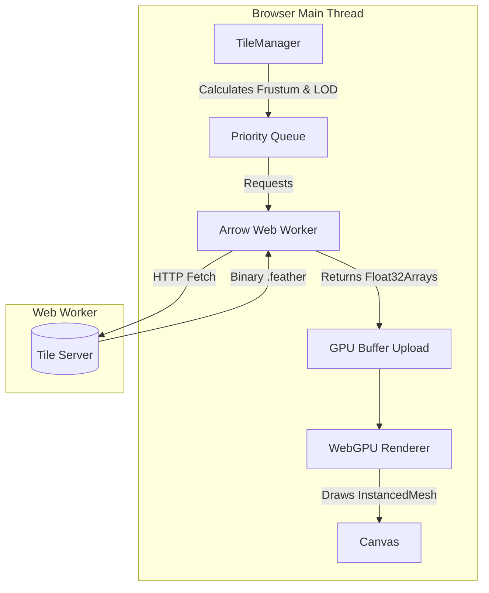
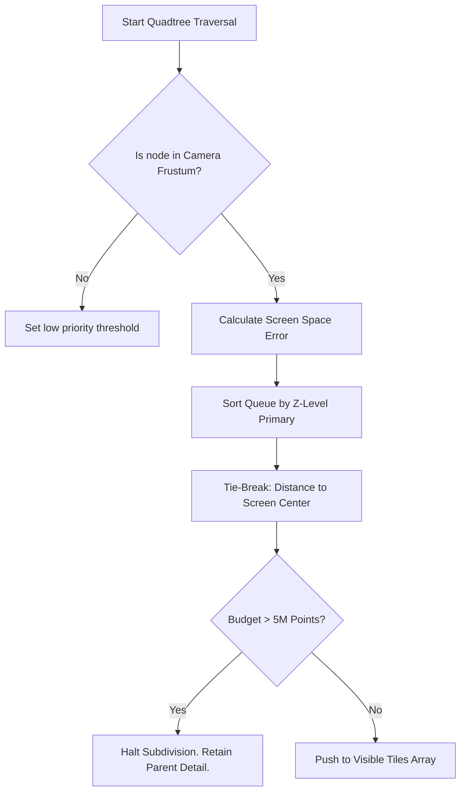

# Deepgraph WebGPU: GAIA Sandbox 🌌

This repository is an experimental sandbox and stress test for the WebGPU-based successor to the Deepgraph static embedding engine. 

The specific goal of this sandbox is to push the boundaries of browser-based rendering by visualizing the **European Space Agency's (ESA) Gaia dataset**—an astronomical catalogue mapping the positions and movements of over a billion stars in the Milky Way galaxy.

Because the Gaia dataset is incredibly dense and massive, it serves as the ultimate stress test for out-of-core data streaming, GPU memory management, and Level-Of-Detail (LOD) algorithms.

## 🚀 Getting Started

### Prerequisites
- Node.js (v18+)
- A modern browser with **WebGPU enabled** (Chrome 113+, Edge 113+, Firefox Nightly, or Safari 18+).

### Setup

```bash
# Clone the repository
git clone https://github.com/kai-erlenbusch/deepgraph-GAIA-sandbox.git
cd deepgraph-GAIA-sandbox

# Install dependencies
npm install

# Start the development server
npm run dev
```

The application will launch on `http://localhost:5173`.

---

## 🏗️ Architecture Overview

The system operates on a multi-threaded pipeline designed to minimize CPU bottlenecks during rendering.



1. **`main.ts`**: Initializes the WebGPU scene and handles the `InstancedMesh`.
2. **`TileManager.ts`**: Handles spatial Quadtree indexing, Additive LOD traversal, and dynamically manages a 5-Million Point Budget.
3. **`ArrowWorker.ts`**: A dedicated Web Worker that downloads Apache Arrow `.feather` files over HTTP and parses them into zero-copy `Float32Array` buffers (extracting the crucial `ix` global index).
4. **`Renderer.ts`**: Manages the WebGPU context, the orbital mechanics, and frame loops.

---

## 🧠 Deep Dive: Additive Point-Budget Traversal

Rendering hundreds of millions of stars simultaneously is beyond the memory limits of standard consumer GPUs. To manage this, `TileManager.ts` enforces a dynamic **5-Million Point Traversal Budget** per frame.

Because the Gaia data uses **Additive LOD**, dropping a parent tile results in a massive black hole on screen. 

To solve this smoothly, we implemented a **Foveated Point-Budget Traversal**.



### How it Works
1. **Primary Sort (Z-Level):** The engine guarantees that all shallow, wide-covering tiles (Z=0, Z=1) across the entire dataset are pushed to the rendering queue *before* the engine evaluates deep tiles (Z=2+). This acts as a foundation and prevents structural "black holes" when panning.
2. **Foveated Tie-Breaker:** When the engine begins choosing between hundreds of deep, detailed tiles (e.g., Z=4), it sorts them based on their distance to the center of the screen. 
3. **Graceful Additive Degradation:** When the 5-Million Point limit is reached, the engine doesn't terminate the traversal; it simply *halts subdivision*. The engine chops off the high-detail Z=4 children at the far edges of the screen, but still renders the Z=3 parent tiles. This ensures the edge of the screen gently lowers in resolution instead of disappearing into black holes.

---

## 🏎️ Deep Dive: WebGPU Instanced Rendering

Traditional WebGL engines struggle to render millions of distinct geometries because the CPU cannot push that many individual `draw` calls without bottlenecking. 

This engine bypasses the CPU overhead using **WebGPU Instanced Rendering**.

Instead of telling the GPU to draw millions of distinct dots, we instruct the GPU to draw **1 generic circle**, but to draw it millions of times simultaneously.

We pass the WebGPU vertex shader a massive array of `Float32` coordinates `[x1, y1, x2, y2...]` extracted directly from the Apache Arrow workers. The GPU executes a localized program for every single instance:
1. "I am instance #45,000"
2. "I will look up coordinate #45,000 in the buffer."
3. "I will move my circle to that specific (x,y) location."

This happens entirely on the GPU silicon, requiring minimal effort from the CPU.

---

## ✨ Recent Performance Optimizations

1. **Synchronized LRU GPU Offloading:** Initially, the engine aggressively destroyed WebGPU tile buffers on *every single frame* if a tile was no longer in the camera frustum. This caused massive garbage-collection spikes (250+ KB per tile) and stalled the WebGPU command queue when zooming out. The architecture has been re-engineered so the WebGPU backend perfectly mirrors the `TileManager` RAM cache. GPU slots are now retained and only zeroed-out when the LRU cache explicitly evicts a stale tile, resulting in buttery-smooth zoom-outs.
2. **Native Quadfeather Axis Alignment:** The deepscatter quadtree generator (`quadfeather`) natively encodes its binary chunks using a Y-up axis orientation (South to North). Standard web-slippy maps use a Y-down orientation. The `TileManager` frustum-culling logic has been updated to natively align with `quadfeather` bounding boxes, resolving a critical issue where "Top Half" tiles were fetching "Bottom Half" binary chunks and drawing them off-screen.

---

## ⚠️ Known Challenges & Current Limitations

This is a stress test sandbox, and several major architectural challenges remain unresolved:

- **LOD Math Sensitivity:** The quadtree traversal is incredibly sensitive to geometric screen-space error logic. Due to the exponential nature of quadtrees ($4^n$), miscalculating the zoom threshold by just one level forces the engine to fetch and render 4x as many tiles. This leads to rapid cache starvation (hitting the 750 tile limit before reaching the edges of the screen) and performance drops.
- **Additive Blending Blowouts:** Because the system uses true Additive Blending, rendering too many deep LOD tiles in the same screen space causes the brightness to stack and wash out the visual field. Balancing visual fidelity at deep zoom levels without hitting these blowouts remains an active balancing act.
- **HTTP Network Throttling:** The browser caps concurrent requests to a single domain (usually 6). When zooming rapidly, the Quadtree can identify 50+ tiles that need loading, creating a network queue bottleneck that causes the UI to visibly wait for data.
- **Additive Popping:** When new points finish downloading and render onto the screen, they appear at 100% opacity instantly. The engine currently lacks temporal anti-aliasing or alpha fade-ins to soften this visual popping effect during deep zooms.

## 📚 Citing

If you use this software in your work or scientific research, it is important to properly cite it to acknowledge the contribution of the developers. When citing, please include the following metadata:

[Insert Names/Title/Year] [Computer software]. https://github.com/kai-erlenbusch/deepgraph-GAIA-sandbox

This citation should include the names of the developers, the year of publication, the title of the software, and the medium (Computer software). The URL should also be included to provide a direct link to the software.

## 📄 Licensing

This project is freely available for non-commercial use under the **Creative Commons Attribution Non Commercial CC BY-NC 4.0** public license. Please note that this license does not permit commercial use of the software. For more information about the limitations of this license, you can refer to the [CC BY-NC 4.0 License Deed](https://creativecommons.org/licenses/by-nc/4.0/).

If you’re planning to use this software commercially, please reach out to us for a Business license.
