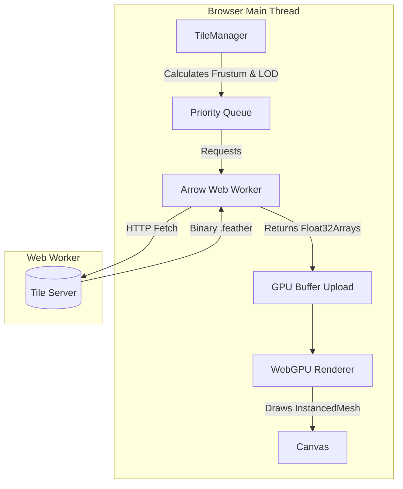
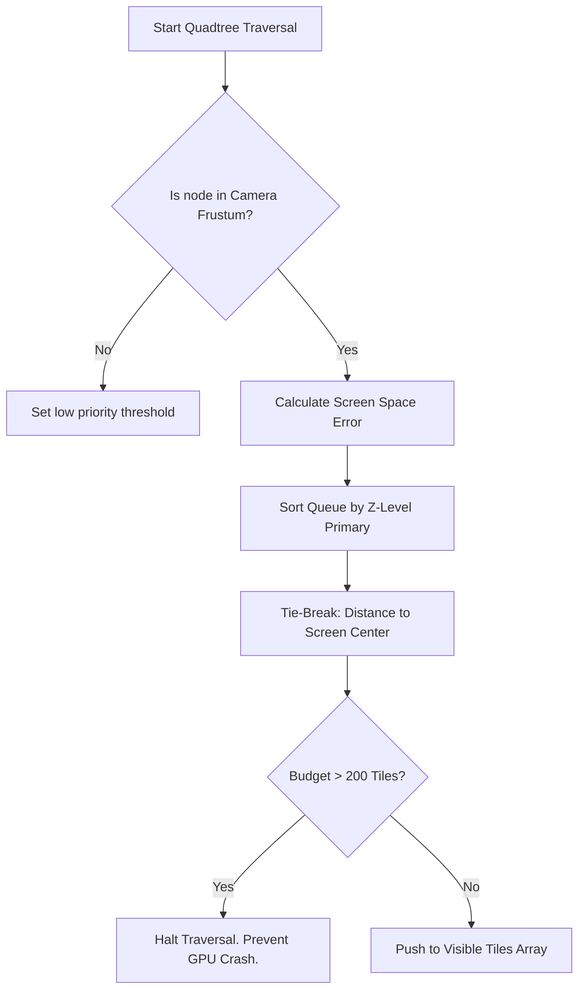

# Deepgraph WebGPU Sandbox 🌌

Deepgraph WebGPU Sandbox is a high-performance, browser-based static embedding engine designed for massive point cloud datasets. It uses **WebGPU**, **Instanced Rendering**, and a **Streaming Apache Arrow Quadtree** to seamlessly visualize tens of millions of points at 60 FPS directly over HTTP.

## 🚀 Getting Started

### Prerequisites
- Node.js (v18+)
- A modern browser with **WebGPU enabled** (Chrome 113+, Edge 113+, Firefox Nightly, or Safari 18+).

### Setup

```bash
# Clone the repository
git clone https://github.com/kai-erlenbusch/deepgraph-GAIA-sandbox.git
cd deepgraph-GAIA-sandbox

# Install dependencies
npm install

# Start the development server
npm run dev
```

The application will launch on `http://localhost:5173`.

---

## 🏗️ Architecture Overview

The system operates on a highly optimized, multi-threaded pipeline designed to minimize CPU bottlenecks during rendering.



1. **`main.ts`**: Initializes the WebGPU scene and handles the `InstancedMesh`.
2. **`TileManager.ts`**: The brain of the operation. Handles spatial Quadtree indexing, Additive LOD traversal, and strictly manages a 200-tile GPU budget.
3. **`ArrowWorker.ts`**: A dedicated Web Worker that downloads Apache Arrow `.feather` files over HTTP and parses them into zero-copy `Float32Array` buffers.
4. **`Renderer.ts`**: Manages the WebGPU context, the orbital mechanics, and frame loops.

---

## 🧠 Deep Dive: Foveated Tie-Breaker BFS

Rendering 100+ million points simultaneously will crash even modern GPUs. To solve this, `TileManager.ts` enforces a strict **200-Tile Traversal Budget** per frame.

However, deciding *which* 200 tiles to render is a mathematically complex problem, especially since our data uses **Additive LOD** (where a missing parent tile results in a massive black hole on screen).

To solve this, we use a **Foveated Tie-Breaker Breadth-First-Search (BFS)**.



### How it Works
1. **Primary Sort (Z-Level):** The engine guarantees that all shallow, wide-covering tiles (Z=0, Z=1) across the entire dataset are pushed to the rendering queue *before* the engine even considers looking at deep tiles (Z=2+). This completely eliminates "black holes" when panning.
2. **Foveated Tie-Breaker:** When the engine begins choosing between hundreds of deep, detailed tiles (e.g., Z=4), it sorts them based on their distance to the center of your screen. 
3. **Graceful Degradation:** When the 200-tile limit is inevitably reached, the engine gracefully chops off the high-detail Z=4 tiles at the far edges of your screen. Because the Z=3 parent tiles were already guaranteed to load in Step 1, the edge of your screen gently blurs instead of disappearing—exactly like Google Maps.

---

## 🏎️ Deep Dive: WebGPU Instanced Rendering

Traditional WebGL engines struggle to render millions of distinct geometries because the CPU cannot push that many individual `draw` calls. 

We bypass this entirely using **WebGPU Instanced Rendering**.

Instead of telling the GPU to draw millions of dots, we tell the GPU to draw **1 single generic circle**, but to draw it **10,000,000 times simultaneously**.

We pass the WebGPU vertex shader a massive array of `Float32` coordinates `[x1, y1, x2, y2...]` extracted directly from our Apache Arrow workers. The GPU executes a tiny program for every single instance:
1. "I am instance #45,000"
2. "I will look up coordinate #45,000 in the buffer."
3. "I will move my circle to that specific (x,y) location."

This happens entirely on the GPU silicon, requiring practically zero effort from the CPU.

---

## ⚠️ Known Challenges & Edge Cases

- **HTTP Network Throttling:** The browser caps concurrent requests (usually to 6). When zooming rapidly, the Quadtree can request 50+ tiles instantly, creating a network queue that causes the UI to visibly wait for data.
- **Additive Popping:** When new points finish downloading and pop onto the screen, they appear at 100% opacity instantly. In the future, temporal anti-aliasing or alpha fade-ins could soften this visual pop.
- **Density Blindness:** The Quadtree divides space, not density. If a tile contains 10 points or 50,000 points, it consumes 1 "tile" from our strict 200-tile budget regardless.

## 📄 License
MIT License
