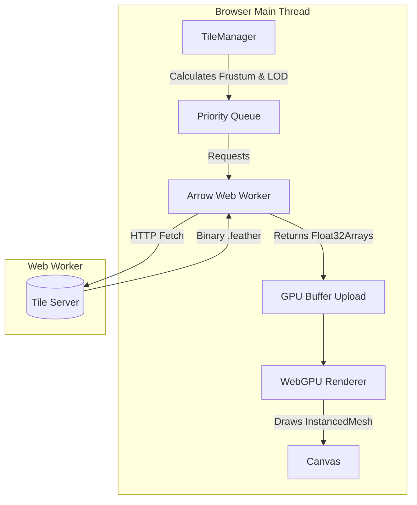
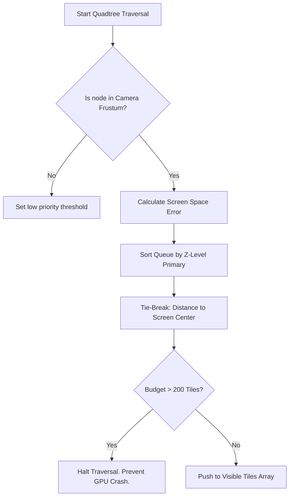

# Deepgraph WebGPU: GAIA Sandbox 🌌

This repository is an experimental sandbox and stress test for the WebGPU-based successor to the Deepgraph static embedding engine. 

The specific goal of this sandbox is to push the boundaries of browser-based rendering by visualizing the **European Space Agency's (ESA) Gaia dataset**—an astronomical catalogue mapping the positions and movements of over a billion stars in the Milky Way galaxy.

Because the Gaia dataset is incredibly dense and massive, it serves as the ultimate stress test for out-of-core data streaming, GPU memory management, and Level-Of-Detail (LOD) algorithms.

## 🚀 Getting Started

### Prerequisites
- Node.js (v18+)
- A modern browser with **WebGPU enabled** (Chrome 113+, Edge 113+, Firefox Nightly, or Safari 18+).

### Setup

```bash
# Clone the repository
git clone https://github.com/kai-erlenbusch/deepgraph-GAIA-sandbox.git
cd deepgraph-GAIA-sandbox

# Install dependencies
npm install

# Start the development server
npm run dev
```

The application will launch on `http://localhost:5173`.

---

## 🏗️ Architecture Overview

The system operates on a multi-threaded pipeline designed to minimize CPU bottlenecks during rendering.



1. **`main.ts`**: Initializes the WebGPU scene and handles the `InstancedMesh`.
2. **`TileManager.ts`**: Handles spatial Quadtree indexing, Additive LOD traversal, and strictly manages a 200-tile GPU budget.
3. **`ArrowWorker.ts`**: A dedicated Web Worker that downloads Apache Arrow `.feather` files over HTTP and parses them into zero-copy `Float32Array` buffers.
4. **`Renderer.ts`**: Manages the WebGPU context, the orbital mechanics, and frame loops.

---

## 🧠 Deep Dive: Foveated Tie-Breaker BFS

Rendering hundreds of millions of stars simultaneously is beyond the memory limits of standard consumer GPUs. To manage this, `TileManager.ts` enforces a strict **200-Tile Traversal Budget** per frame.

However, deciding *which* 200 tiles to render is a mathematically complex problem, especially since the Gaia data uses **Additive LOD** (where a missing parent tile results in a massive black hole on screen).

To solve this, we implemented a **Foveated Tie-Breaker Breadth-First-Search (BFS)**.



### How it Works
1. **Primary Sort (Z-Level):** The engine guarantees that all shallow, wide-covering tiles (Z=0, Z=1) across the entire dataset are pushed to the rendering queue *before* the engine evaluates deep tiles (Z=2+). This acts as a foundation and prevents structural "black holes" when panning.
2. **Foveated Tie-Breaker:** When the engine begins choosing between hundreds of deep, detailed tiles (e.g., Z=4), it sorts them based on their distance to the center of the screen. 
3. **Graceful Degradation:** When the 200-tile limit is reached, the engine chops off the high-detail Z=4 tiles at the far edges of the screen. Because the Z=3 parent tiles were already guaranteed to load in Step 1, the edge of the screen gently lowers in resolution instead of disappearing.

---

## 🏎️ Deep Dive: WebGPU Instanced Rendering

Traditional WebGL engines struggle to render millions of distinct geometries because the CPU cannot push that many individual `draw` calls without bottlenecking. 

This engine bypasses the CPU overhead using **WebGPU Instanced Rendering**.

Instead of telling the GPU to draw millions of distinct dots, we instruct the GPU to draw **1 generic circle**, but to draw it millions of times simultaneously.

We pass the WebGPU vertex shader a massive array of `Float32` coordinates `[x1, y1, x2, y2...]` extracted directly from the Apache Arrow workers. The GPU executes a localized program for every single instance:
1. "I am instance #45,000"
2. "I will look up coordinate #45,000 in the buffer."
3. "I will move my circle to that specific (x,y) location."

This happens entirely on the GPU silicon, requiring minimal effort from the CPU.

---

## ⚠️ Known Challenges & Current Limitations

This is a stress test sandbox, and several major architectural challenges remain unresolved:

- **HTTP Network Throttling:** The browser caps concurrent requests to a single domain (usually 6). When zooming rapidly, the Quadtree can identify 50+ tiles that need loading, creating a network queue bottleneck that causes the UI to visibly wait for data.
- **Additive Popping:** When new points finish downloading and render onto the screen, they appear at 100% opacity instantly. The engine currently lacks temporal anti-aliasing or alpha fade-ins to soften this visual popping effect during deep zooms.
- **Density Blindness:** The Quadtree algorithm strictly divides spatial volume, not data density. A tile at the galactic pole might contain 10 stars, while a tile in the galactic plane contains 50,000 stars. Both consume exactly 1 "tile" from the strict 200-tile budget, resulting in occasional horizontal banding where the LOD algorithm wastes budget rendering empty space.

## 📄 License
MIT License
